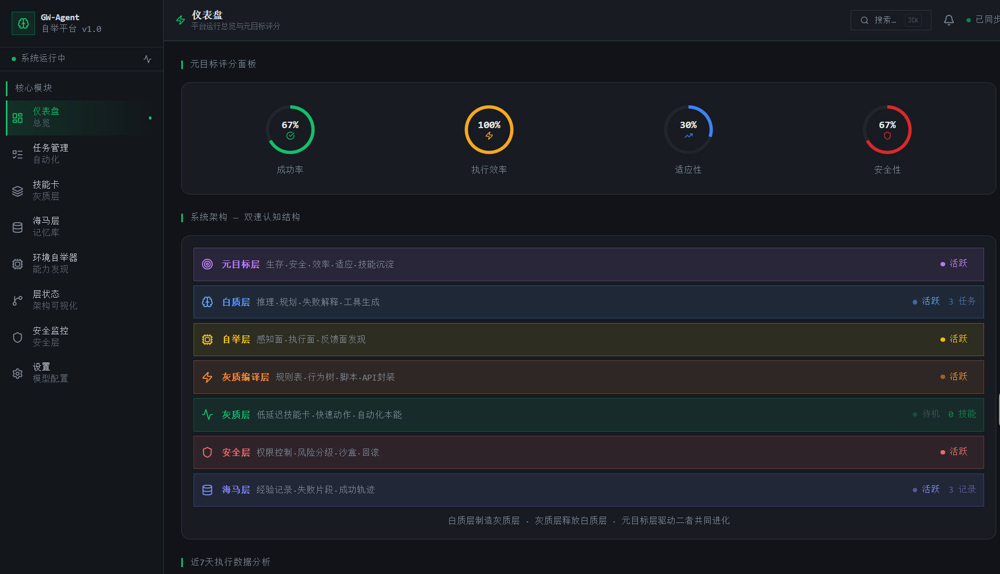
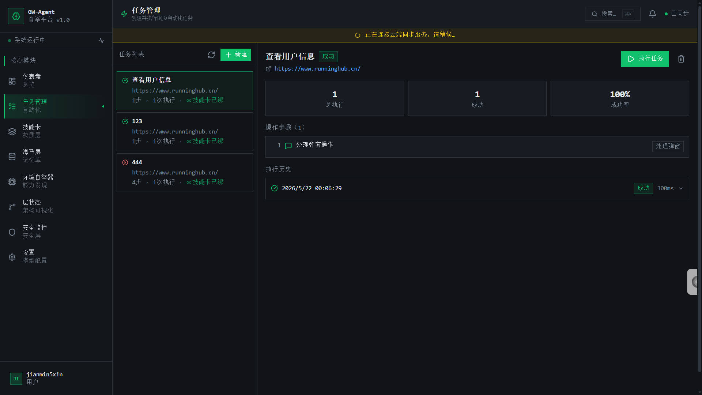
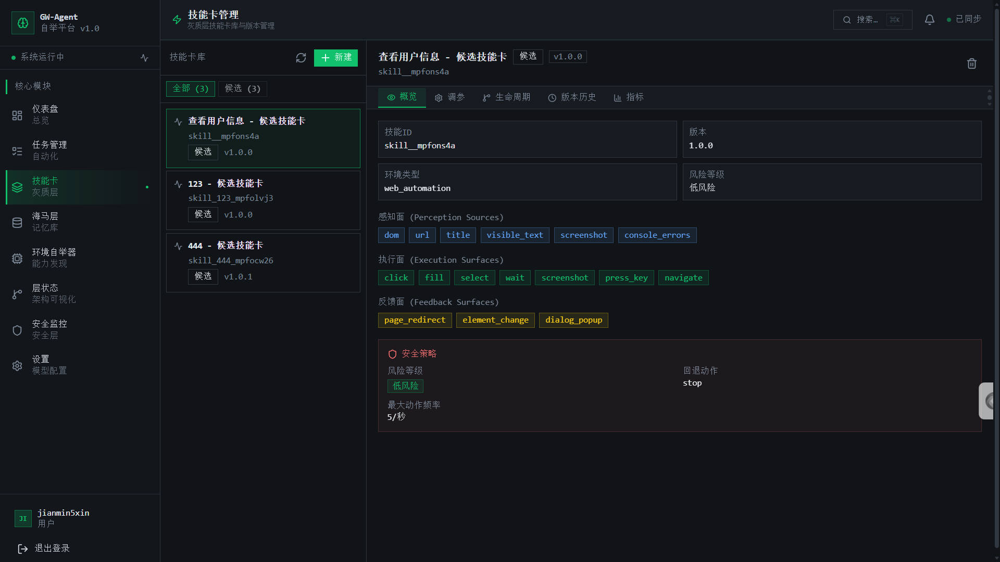
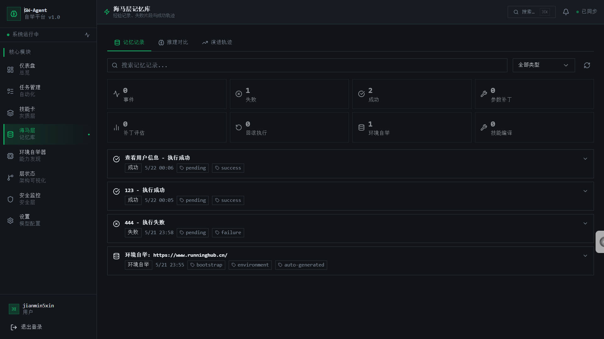
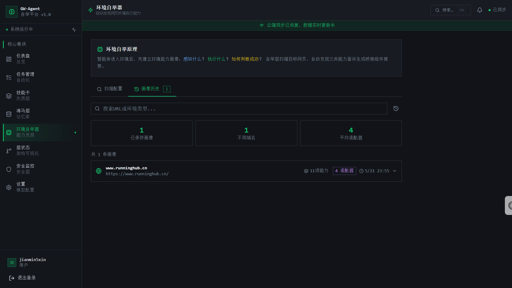
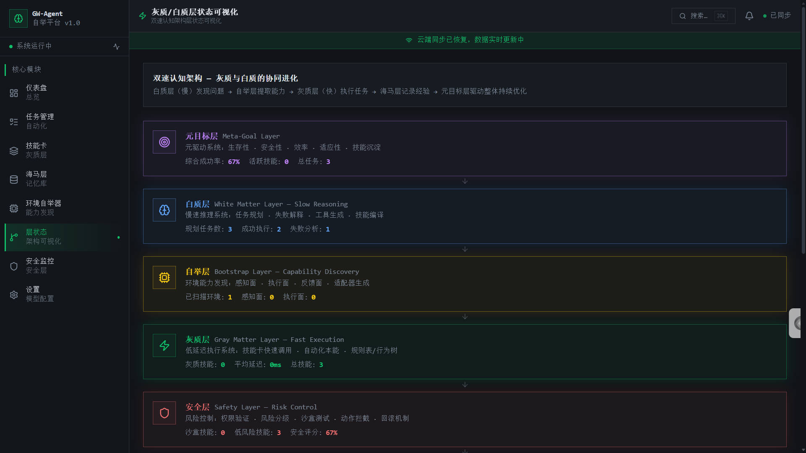
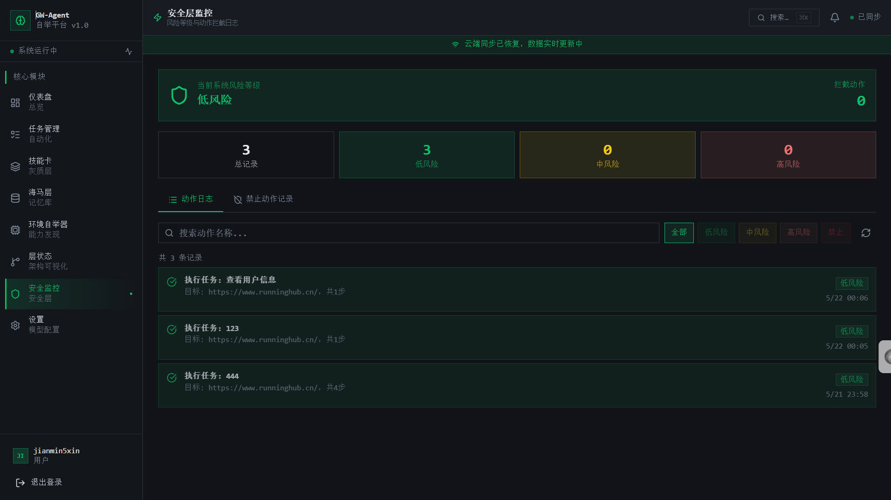
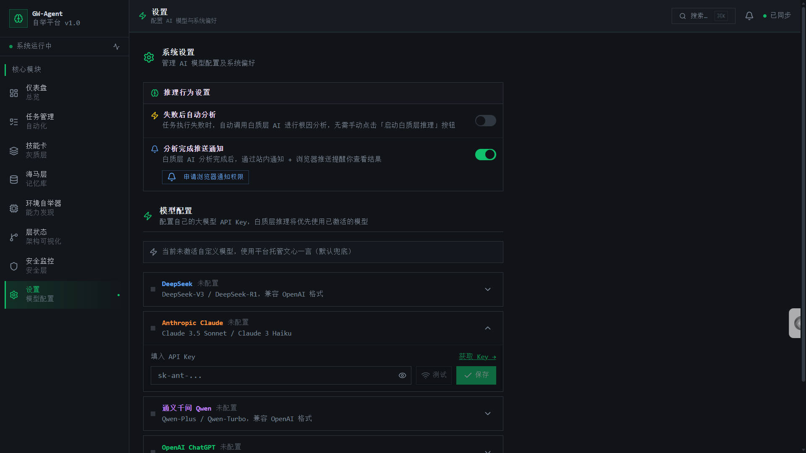

# Black-White-Brain / GW-Agent

> 灰质-白质自举智能体网页自动化平台
> A brain-inspired self-evolving web automation agent platform.

## 介绍

**Black-White-Brain / GW-Agent** 是一个基于"灰质 / 白质"双速认知结构设计的网页自动化智能体平台。

它不是传统意义上只会录制点击、重复执行脚本的 RPA 工具，而是尝试构建一个可以持续进化的自动化系统：系统能够扫描网页环境、识别可操作能力、执行任务、记录成功与失败经验，并在失败后调用白质层大模型进行原因分析、参数补丁生成和技能卡沉淀。

项目的核心目标是让网页自动化任务形成一个闭环：

```text
环境自举 → 任务执行 → 失败复盘 → 经验记忆 → 技能沉淀 → 安全约束 → 持续进化
```

当前版本是一个 MVP / Alpha 原型，已经具备完整的前端控制台、任务管理、技能卡管理、海马层记忆库、环境自举器、层状态可视化、安全层监控和模型配置页面。

## 核心理念

项目采用类脑系统隐喻，把智能体自动化能力拆分为多个层级：

| 层级    | 英文名称                | 作用                                 |
| ----- | ------------------- | ---------------------------------- |
| 元目标层  | Meta-Goal Layer     | 负责衡量系统总体目标，包括成功率、效率、适应性、安全性和技能沉淀   |
| 白质层   | White Matter Layer  | 慢速推理层，负责失败解释、策略规划、参数补丁、工具生成和技能编译建议 |
| 自举层   | Bootstrap Layer     | 负责扫描目标网页，发现感知面、执行面、反馈面，并生成环境画像     |
| 灰质编译层 | Gray Compiler Layer | 将成功轨迹、规则表、行为树或脚本编译成可复用技能卡          |
| 灰质层   | Gray Matter Layer   | 快速执行层，负责低延迟调用技能卡，执行点击、填写、等待、截图等动作  |
| 安全层   | Safety Layer        | 负责权限控制、风险分级、动作拦截、沙盒测试和回滚机制         |
| 海马层   | Hippocampus Layer   | 负责保存经验记录、失败片段、成功轨迹、环境画像和参数补丁       |

核心思想是：

> 白质层制造灰质层，灰质层释放白质层。
> 白质层负责慢思考和结构化归纳，灰质层负责快速执行和可复用技能调用，海马层负责长期经验积累。

## 当前功能

当前项目已经实现或初步实现了以下能力：

* 深色科技风格的 Web 控制台。
* 用户登录与 Supabase Auth 集成。
* 仪表盘展示平台运行总览与元目标评分。
* 任务管理：创建任务、编辑步骤、绑定技能卡、执行任务、查看历史记录。
* 技能卡管理：维护候选技能卡、版本、感知面、执行面、反馈面、安全策略和可调参数。
* 海马层记忆库：记录成功、失败、环境自举、参数补丁、技能编译等经验片段。
* 环境自举器：扫描目标 URL，生成网页环境能力画像。
* 层状态可视化：展示元目标层、白质层、自举层、灰质层、安全层和海马层之间的协同关系。
* 安全层监控：记录动作风险等级，支持低风险、中风险、高风险和禁止动作分类。
* 模型配置：支持 DeepSeek、Anthropic Claude、通义千问 Qwen、OpenAI ChatGPT 等模型提供商。
* Supabase Edge Functions：支持环境扫描、环境画像推理、白质层分析、灰质技能编译和模型连接测试。

## 项目截图

### 仪表盘：元目标评分与系统架构



### 任务管理：任务执行与历史记录



### 技能卡管理：候选技能与安全策略



### 海马层记忆库：经验、失败、成功、环境画像



### 环境自举器：目标网页能力画像



### 层状态可视化：双速认知架构



### 安全层监控：风险等级与动作日志



### 设置：白质层模型配置与通知



## 目录结构

```text
.
├── README.md                         # 项目说明文档
├── CHANGELOG.md                      # 版本变更记录
├── components.json                   # 组件库配置
├── index.html                        # Vite 入口 HTML
├── package.json                      # 包管理与脚本配置
├── pnpm-lock.yaml                    # pnpm 锁定文件
├── pnpm-workspace.yaml               # pnpm workspace 配置
├── postcss.config.js                 # PostCSS 配置
├── tailwind.config.js                # Tailwind CSS 配置
├── biome.json                        # Biome 代码规范配置
├── vite.config.ts                    # Vite 配置
├── vite.config.dev.ts                # 开发环境 Vite 配置
├── tsconfig.json                     # TypeScript 总配置
├── tsconfig.app.json                 # TypeScript 前端配置
├── tsconfig.node.json                # TypeScript Node 端配置
├── tsconfig.check.json               # TypeScript 检查配置
├── public                            # 静态资源目录
│   ├── favicon.png                   # 网站图标
│   └── images                        # 图片资源
├── docs                              # 项目文档目录
│   ├── prd.md                        # 产品需求文档
│   └── screenshots                   # README 展示截图
│       ├── dashboard.jpg
│       ├── tasks.jpg
│       ├── skills.jpg
│       ├── memory.jpg
│       ├── bootstrap.jpg
│       ├── layers.jpg
│       ├── security.jpg
│       └── settings.jpg
├── src                               # 前端源码目录
│   ├── App.tsx                       # React 应用入口组件
│   ├── main.tsx                      # React 挂载入口
│   ├── routes.tsx                    # 路由配置
│   ├── index.css                     # 全局样式
│   ├── global.d.ts                   # 全局类型声明
│   ├── vite-env.d.ts                 # Vite 环境类型声明
│   ├── svg.d.ts                      # SVG 类型声明
│   ├── components                    # 通用组件目录
│   │   ├── common                    # 通用业务组件
│   │   ├── layouts                   # 布局组件
│   │   ├── memory                    # 海马层记忆相关组件
│   │   ├── notifications             # 通知组件
│   │   ├── settings                  # 设置页组件
│   │   ├── ui                        # 基础 UI 组件
│   │   └── white-matter              # 白质层分析相关组件
│   ├── contexts                      # React Context 目录
│   │   └── AuthContext.tsx           # 登录鉴权上下文
│   ├── db                            # 数据库连接配置
│   │   └── supabase.ts               # Supabase 客户端
│   ├── hooks                         # 通用 Hooks
│   ├── lib                           # 工具库目录
│   │   ├── notifications.ts          # 通知工具
│   │   ├── safetyGate.ts             # 安全门逻辑
│   │   ├── sse.ts                    # SSE 事件流工具
│   │   └── utils.ts                  # 通用工具函数
│   ├── pages                         # 页面目录
│   │   ├── BootstrapPage.tsx         # 环境自举器页面
│   │   ├── DashboardPage.tsx         # 仪表盘页面
│   │   ├── LayersPage.tsx            # 层状态可视化页面
│   │   ├── LoginPage.tsx             # 登录页面
│   │   ├── MemoryPage.tsx            # 海马层记忆库页面
│   │   ├── SecurityPage.tsx          # 安全层监控页面
│   │   ├── SettingsPage.tsx          # 系统设置页面
│   │   ├── SkillsPage.tsx            # 技能卡管理页面
│   │   └── TasksPage.tsx             # 任务管理页面
│   ├── services                      # 数据库交互与业务服务目录
│   ├── tests                         # 测试文件目录
│   ├── types                         # 类型定义目录
│   └── utils                         # 工具函数目录
├── supabase                          # Supabase 后端目录
│   ├── config.toml                   # Supabase 配置
│   ├── functions                     # Supabase Edge Functions
│   │   ├── bootstrap-env             # Bootloader 原始环境扫描
│   │   ├── bootstrap-environment     # 环境画像生成
│   │   ├── compile-gray-skill        # 灰质技能编译
│   │   ├── test-model-connection     # 模型连接测试
│   │   └── white-matter-analyze      # 白质层失败分析
│   └── migrations                    # 数据库迁移目录
│       └── migration.sql             # 数据库结构与 RPC 定义
└── .rules                            # 代码质量与静态检查规则
    ├── check.sh
    ├── testBuild.sh
    └── *.yml
```

## 技术栈

| 分类           | 技术                                                                  |
| ------------ | ------------------------------------------------------------------- |
| 前端框架         | React 18 + TypeScript                                               |
| 构建工具         | Vite / rolldown-vite                                                |
| 路由           | React Router 7                                                      |
| 样式           | Tailwind CSS                                                        |
| UI 组件        | Radix UI / shadcn 风格组件                                              |
| 图标           | lucide-react                                                        |
| 图表           | Recharts                                                            |
| 通知           | sonner + Browser Notification API                                   |
| 后端服务         | Supabase Auth / Database / Realtime / Edge Functions                |
| Edge Runtime | Deno                                                                |
| 浏览器自动化       | Playwright Core + Browserless CDP                                   |
| 大模型接入        | DeepSeek / Anthropic Claude / Qwen / OpenAI                         |
| 代码质量         | TypeScript Native Preview / Biome / ast-grep / Tailwind build check |

## 本地开发

### 如何在本地编辑代码？

你可以使用 [VSCode](https://code.visualstudio.com/Download)、Cursor、WebStorm 或任何常用 IDE 编辑器。

本项目是一个 Vite + React + TypeScript 项目，本地开发需要安装 Node.js 和 npm，推荐使用 Node.js 20 或更高版本。

### 环境要求

```bash
# Node.js >= 20
# npm >= 10

node -v
npm -v
```

示例版本：

```bash
node -v   # v20.18.3
npm -v    # 10.8.2
```

### 在 Windows 上安装 Node.js

1. 访问 Node.js 官网：https://nodejs.org/
2. 下载适合 Windows 的 LTS 版本安装包。
3. 双击安装程序，按照提示完成安装。
4. 打开 CMD、PowerShell 或 IDE 终端，输入以下命令验证安装：

```bash
node -v
npm -v
```

### 在 macOS 上安装 Node.js

推荐使用 Homebrew：

```bash
brew install node
```

如果尚未安装 Homebrew，可以先运行：

```bash
/bin/bash -c "$(curl -fsSL https://raw.githubusercontent.com/Homebrew/install/HEAD/install.sh)"
```

也可以直接访问 Node.js 官网下载 macOS `.pkg` 安装包。

安装完成后验证：

```bash
node -v
npm -v
```

### 安装依赖

进入项目根目录后执行：

```bash
npm i
```

如果你使用 pnpm，也可以执行：

```bash
pnpm install
```

### 配置环境变量

请不要把真实 `.env` 提交到 GitHub。

建议在项目根目录创建 `.env.local` 或 `.env`：

```bash
VITE_SUPABASE_URL="https://your-project.supabase.co"
VITE_SUPABASE_ANON_KEY="your-anon-key"
VITE_APP_ID="your-app-id"
```

同时建议创建一个安全的 `.env.example`：

```bash
VITE_SUPABASE_URL=""
VITE_SUPABASE_ANON_KEY=""
VITE_APP_ID=""
```

并在 `.gitignore` 中加入：

```gitignore
.env
.env.*
!.env.example
```

### 启动开发服务器

当前源码包中的 `package.json` 里，`dev` 和 `build` 脚本可能是平台导出的占位命令。

如果本地需要直接启动 Vite，可以使用：

```bash
npx vite --host 127.0.0.1
```

然后访问：

```text
http://127.0.0.1:5173
```

也可以把 `package.json` 中的 scripts 改成：

```json
{
  "scripts": {
    "dev": "vite --host 127.0.0.1",
    "build": "vite build",
    "preview": "vite preview",
    "lint": "tsgo -p tsconfig.check.json; npx biome lint; .rules/check.sh; npx tailwindcss -i ./src/index.css -o /dev/null 2>&1 | grep -E '^(CssSyntaxError|Error):.*' || true; .rules/testBuild.sh"
  }
}
```

之后执行：

```bash
npm run dev
```

## 后端服务开发

本项目后端主要基于 Supabase，包括：

* Supabase Auth：用户登录与身份管理。
* Supabase Database：任务、技能卡、记忆片段、环境画像、安全日志等数据表。
* Supabase Realtime：用于任务状态、通知和数据同步。
* Supabase Edge Functions：用于环境扫描、白质层推理、技能编译和模型连接测试。

### 数据库迁移

数据库结构位于：

```text
supabase/migrations/migration.sql
```

部署前建议先在测试 Supabase 项目中执行，确认表结构、RLS、RPC、触发器和权限符合预期。

### Edge Functions

当前项目包含以下 Edge Functions：

```text
supabase/functions/bootstrap-env
supabase/functions/bootstrap-environment
supabase/functions/compile-gray-skill
supabase/functions/test-model-connection
supabase/functions/white-matter-analyze
```

可使用 Supabase CLI 部署：

```bash
supabase functions deploy bootstrap-env
supabase functions deploy bootstrap-environment
supabase functions deploy compile-gray-skill
supabase functions deploy test-model-connection
supabase functions deploy white-matter-analyze
```

### Edge Function Secrets

示例：

```bash
supabase secrets set SUPABASE_URL="https://your-project.supabase.co"
supabase secrets set SUPABASE_ANON_KEY="your-anon-key"
supabase secrets set SUPABASE_SERVICE_ROLE_KEY="your-service-role-key"
supabase secrets set BROWSERLESS_API_KEY="your-browserless-key"
supabase secrets set INTEGRATIONS_API_KEY="your-platform-model-key"
```

其中：

```text
BROWSERLESS_API_KEY
```

用于真实浏览器环境扫描。

```text
INTEGRATIONS_API_KEY
```

可作为平台托管模型的兜底 Key。

## 三方 API 配置

项目设置页支持配置多种大模型 API：

* DeepSeek
* Anthropic Claude
* 通义千问 Qwen
* OpenAI ChatGPT

用户输入的模型 API Key 不建议写入前端环境变量，也不建议提交到代码仓库。

当前设计是：

```text
用户在设置页输入 API Key
        ↓
写入 model_configs 表
        ↓
Edge Function 在服务端读取
        ↓
白质层分析 / 模型连接测试 / 技能编译时使用
```

这样可以避免 API Key 暴露在前端代码中。

## 主要数据表

| 表名                    | 作用                                      |
| --------------------- | --------------------------------------- |
| profiles              | 用户档案、角色、白质层自动分析配置、通知配置                  |
| tasks                 | 网页自动化任务定义，包括目标 URL、步骤 JSON、技能卡绑定、环境画像绑定 |
| task_runs             | 每次任务执行记录，包括状态、耗时、技能版本快照、分析结果            |
| task_run_steps        | 步骤级执行轨迹，包括动作、选择器、状态、错误、安全等级和证据字段        |
| skill_cards           | 可复用技能卡，包括感知面、执行面、反馈面、可调参数、安全策略和指标       |
| skill_history         | 技能卡版本历史                                 |
| memory_episodes       | 海马层记忆片段，包括失败、成功、补丁、回滚、自举和编译记录           |
| environment_profiles  | 环境能力画像，包括感知面、执行面、反馈面、元素集合和适配器           |
| raw_environment_scans | Bootloader 原始扫描结果，只保存事实数据               |
| security_logs         | 安全层动作日志与阻断记录                            |
| model_configs         | 用户自带模型 API Key 配置与激活状态                  |
| notifications         | 站内通知                                    |

## 测试与质量检查

执行：

```bash
npm run lint
```

当前 lint 脚本包含：

```text
TypeScript 类型检查
Biome lint
ast-grep 静态规则检查
Tailwind CSS 语法检查
Vite build 检查
```

核心测试文件：

```text
src/tests/evolutionChartUtils.test.ts
```

该测试文件覆盖了参数补丁、技能版本、任务-技能绑定、并发补丁安全、回滚应用、步骤级轨迹、白质层 Grounding、环境自举、灰质技能编译和 Safety Gate 等场景。

## GitHub 推送前检查

正式推送到 GitHub 前，请务必确认不要提交敏感信息。

### 1. 不要提交 `.env`

如果 `.env` 已经被 Git 跟踪，执行：

```bash
git rm --cached .env
```

然后确认 `.gitignore` 中包含：

```gitignore
.env
.env.*
!.env.example
```

### 2. 检查 Git 状态

```bash
git status
```

### 3. 检查最近提交

```bash
git log --oneline -5
```

### 4. 确认没有提交密钥

可以搜索：

```bash
grep -R "sk-" . --exclude-dir=node_modules --exclude-dir=.git
grep -R "SUPABASE_SERVICE_ROLE_KEY" . --exclude-dir=node_modules --exclude-dir=.git
```

如果仓库曾经提交过真实密钥，建议直接作废旧密钥，重新生成新密钥。

## 推荐仓库描述

GitHub Description 可以填写：

```text
A brain-inspired web automation agent platform with gray matter execution, white matter reasoning, hippocampus memory, bootstrap capability discovery, safety control, and self-evolving skill cards.
```

如果想更短，可以填写：

```text
Brain-inspired self-evolving web automation agent platform.
```

## 了解更多

本项目目前是一个实验性原型，主要探索以下方向：

* 网页自动化能否从"写死脚本"进化到"可学习技能"。
* 大模型是否可以作为白质层，对失败任务进行结构化复盘。
* 成功轨迹是否可以被编译成灰质层技能卡。
* 环境自举是否可以降低新网站自动化适配成本。
* 安全层是否可以在智能体执行前形成可靠的动作风险边界。

如果本项目来自源码导出环境，也可以参考平台帮助文档：

[源码导出帮助文档](https://cloud.baidu.com/doc/MIAODA/s/Xmewgmsq7)

## 许可证

当前项目尚未明确开源许可证。

如果计划公开发布，建议补充一个 `LICENSE` 文件。常见选择：

* MIT License：宽松开源，适合个人项目和原型项目。
* Apache License 2.0：更重视专利授权与企业使用。
* Proprietary：暂不开放授权，仅展示项目代码。
